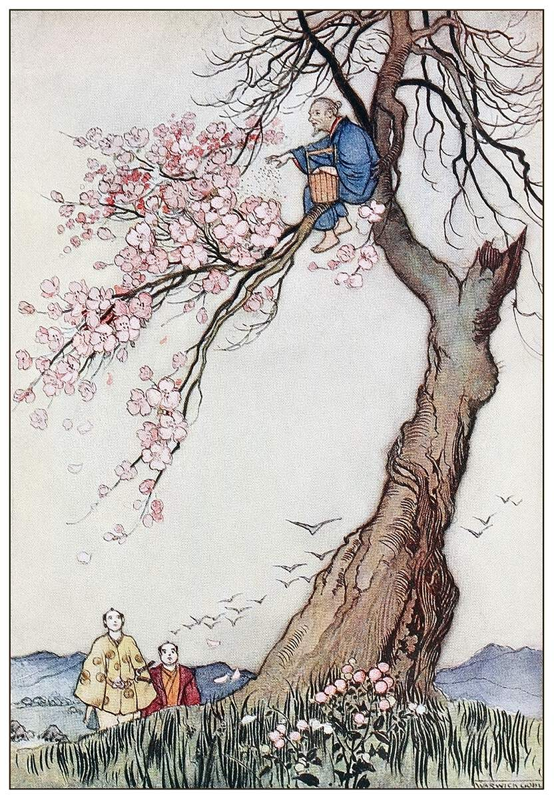

# Mura

## What
An in-memory SQL Query Compiler built on Apache Arrow.

## Etymology
Named after [Yoshiko Futamura](https://fi.ftmr.info/), namesake of the Futamura Projections.

## Rationale
The idea of Mura is to build a simple query compiler to be later specialised into a query interpreter, as discussed in [How to Architect a Query Compiler, Revisited](https://www.cs.purdue.edu/homes/rompf/papers/tahboub-sigmod18.pdf). Mura uses [Apache Arrow](arrow.apache.org) as the memory model. It supports SQL query execution against Parquet, and against in-memory data.

## Credits 
- [Illustration Credits](https://www.oldbookillustrations.com/illustrations/hana-saka-jiji/)
